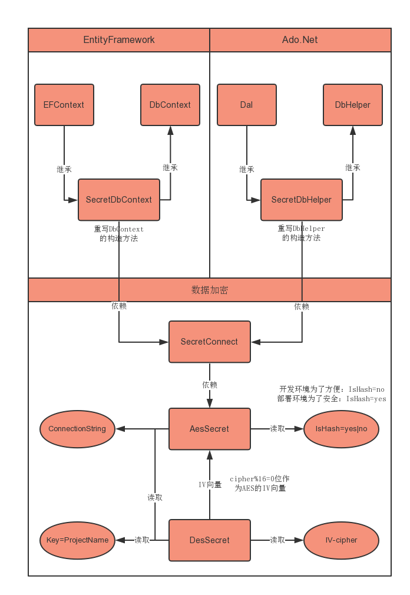
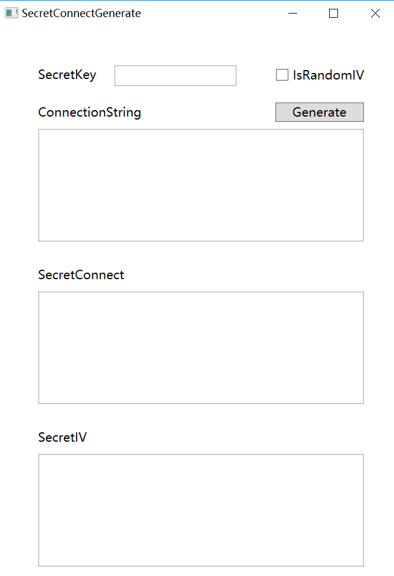

Watson.SecretConnect
=====


=====

# 加密方案
1. SecretKey+AttachKey按【一定规则】混合摘要生成AesKey
2. 随机生成512位IV
3. IV+AttachIV按【一定规则】混合摘要，按【一定规则】提取128位作为AesIV
4. 使用Aes加密算法加密ConnectionString -> 输出SecretConnect
-----
5. SecretKey+AttachKey按【一定规则】混合摘要，按【一定规则】提取64位生成DesKey
6. AttachIV摘要后按【一定规则】提取128位作为DesIV
7. 使用Des加密算法加密512位IV -> 输出SecretIV

# 使用方法
## 1. 生成SecretConnect和SecretIV
1.1 运行Watson.SecretGenerate.exe

1.2 输入SecretKey

1.3 IsRandomIV是否随机生成偏移向量


## 2. 引用NuGet
        Install-Package Watson.SecretConnect
## 3. 添加配置文件节点
3.1 添加ConnectionString
```CSharp
<configuration>
  <connectionStrings>
    <add name="ConnectionString" connectionString="SecretConnect"/>
  </connectionStrings>
</configuration>
```
3.2 添加AppSetting
```CSharp
<configuration>
  <appSettings>
    <!-- 是否加密 -->
    <add key="IsSecret" value="yes|no"/>
    <!-- SecretKey -->
    <add key="SecretKey" value="SecretKey"/>
    <!-- 如果生成时勾选IsRandomIV，则把生成的SecretIV添加到这个节点种。如果没勾选使用默认IV，则不要添加这个节点 -->
    <add key="SecretIV" value="SecretIV"/>
  </appSettings>
</configuration>
```
# 在EntityFramework中使用
修改Context.cs和Context.tt的继承关系

从继承System.Data.Entity.DbContext修改成继承Watson.SecretConnect.SecretEF
```CSharp
public class myEntity : Watson.SecretConnect.SecretEF
{
  public myEntity() : base("name=ConnectionString") {}
}
```
# 在Ado.Net中使用
修改DataAccess数据连接类的继承关系
public class myDataAccess : Watson.AdoDotNet.MsSql|Oracle|MySql
{
  public myDataAccess() : base() {}
  public myDataAccess(string nameOrConnectionString) : base(nameOrConnectionString) {}
}
